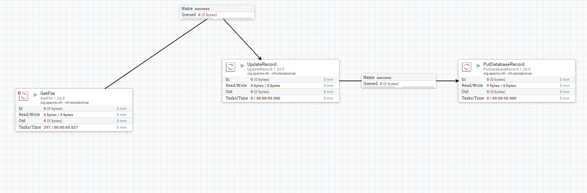
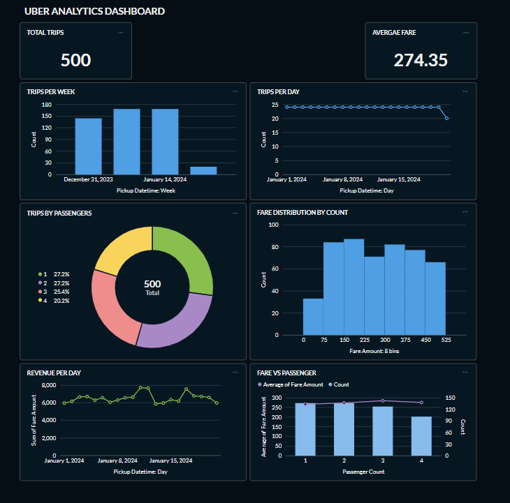
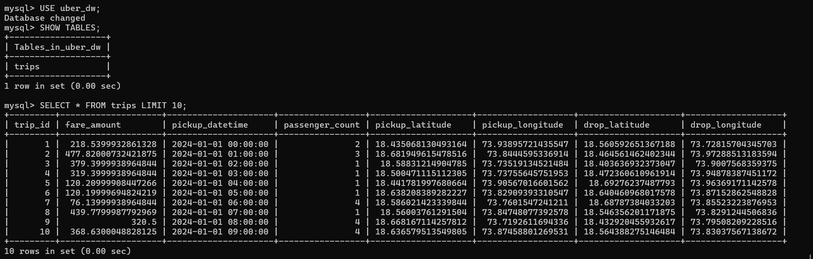

# Uber ETL Data Warehouse Dashboard

## Project Overview
An end-to-end DWBI project using Apache NiFi and Metabase to process Uber trip data through ETL pipelines and visualize analytics dashboards.

## Technologies Used
- Apache NiFi
- MySQL
- Metabase
- Java

## Dataset

The project uses an Uber trip dataset containing:
- Trip ID
- Fare Amount
- Pickup Datetime
- Passenger Count
- Pickup Coordinates
- Dropoff Coordinates

Dataset File:
`uber_trip_dataset.csv`

## ETL Workflow
1. Extract CSV data using GetFile
2. Transform records using UpdateRecord
3. Load records into MySQL using PutDatabaseRecord

## Features
- Total Trips KPI
- Revenue Analysis
- Fare Distribution
- Passenger Trends
- Trips Per Day/Week

## Screenshots

### Apache NiFi ETL Pipeline

### Metabase Dashboard

### MySQL Database Output

